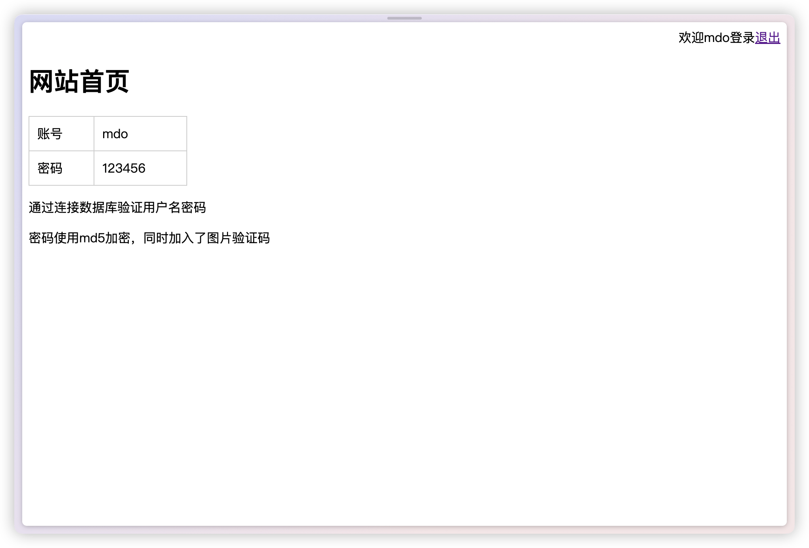
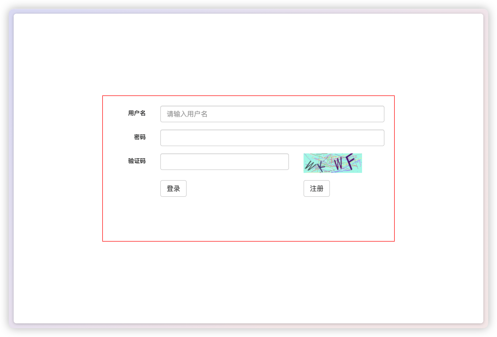
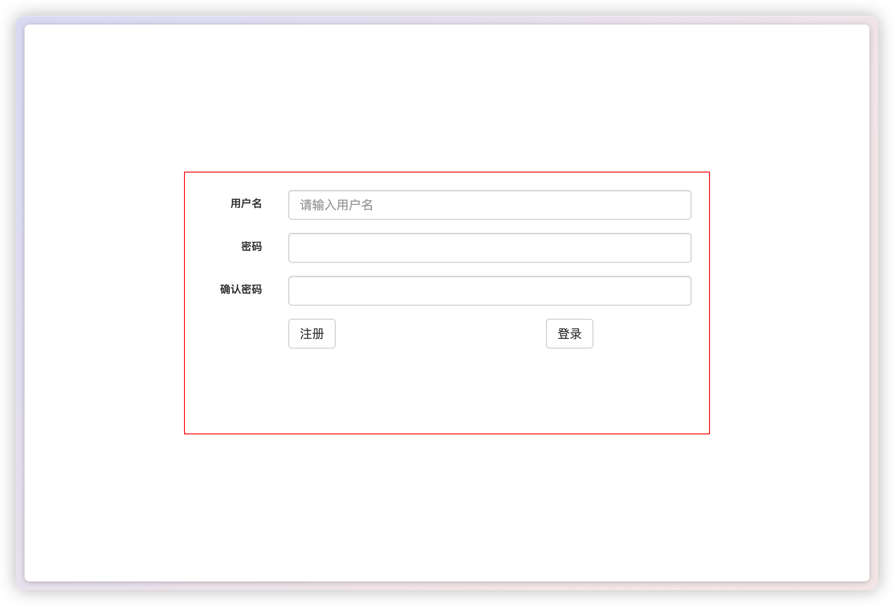

# php-login

一个可以登录注册的PHP页面，通过连接数据库验证用户名密码，同时加入了图片验证码。

## 功能特点

- 用户登录：通过数据库验证用户名和密码。
- 用户注册：支持新用户注册并保存到数据库。
- 图片验证码：在登录和注册时加入验证码，提高安全性。





## 配置说明

首次使用请运行`./plogin.sql`文件创建数据库；

更新 `./code.php` 和 `./checksign.php` 文件中的数据库配置项。

```php
数据库(服务器地址, 用户名, 密码, 数据库)
$db = new mysqli("localhost", "plogin", "BeS5AHLDPrkNni8S", "plogin");
```

## 文件说明

- `index.php`：主页面，用户可以在此登录或注册。
- `checklogin.php`：处理用户登录逻辑。
- `checksign.php`：处理用户注册逻辑。
- `db.php`：包含数据库连接和配置项。
- `checkuser.php`：检查登录信息的合法性。
- `code.php`：生成图片验证码。
- `exit.php`：退出登录。

## 安装与使用

1. 下载或克隆本项目到本地服务器。
2. 导入数据库文件（例如：`plogin.sql`）以创建相应的数据表。
3. 修改 `code.php` 和 `checksign.php` 文件中的数据库配置项以匹配您的数据库设置。
4. 在浏览器中打开 `index.php` 页面开始使用。